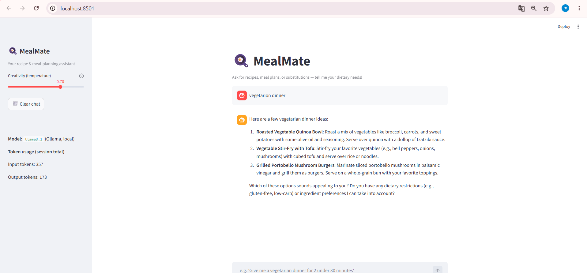
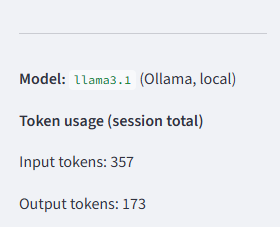
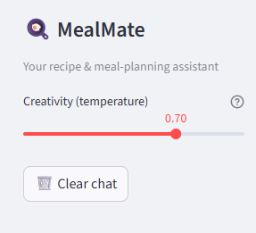

# MealMate — Recipe & Meal-Planning Chat Assistant

## Summary

MealMate is a focused chat assistant that helps people plan meals, find
recipes, and adapt them to dietary constraints (vegetarian, vegan,
gluten-free, allergies, low-carb, etc.). It's aimed at home cooks who want
quick, practical recipe ideas and substitutions based on what they have on
hand and what they can/can't eat.

## How to run it

1. Install [Ollama](https://ollama.com) and pull a model:
   ```bash
   ollama pull llama3.1
   ```
   Make sure the Ollama server is running (it runs as a background
   service after install, or start it manually with `ollama serve`).

2. Clone the repo and install Python dependencies:
   ```bash
   pip install -r requirements.txt
   ```

3. (Optional) copy `.env.example` to `.env` and adjust the model name /
   Ollama host if needed:
   ```bash
   cp .env.example .env
   ```

4. Run the app:
   ```bash
   streamlit run app.py
   ```

## Model choice

**Local model via Ollama (`llama3.1`)** was chosen over a hosted API.

**Cost/latency trade-off accepted:** running locally means $0 marginal
cost per request and no dependency on an internet connection or API
quota — useful for unlimited iteration during development and eval runs,
and keeps all data on-device. The trade-off is latency and quality: on a
laptop without a strong GPU, generation (and especially time-to-first-token)
is slower than a hosted model, and a 7–8B local model is generally less
capable/reliable than a large hosted model. For a small assistant where
privacy, offline use, and zero API cost matter more than peak quality or
raw speed, the local Ollama model was the better fit. Token usage
(`prompt_eval_count` / `eval_count` from Ollama) is logged each turn so
this trade-off stays visible.

## Sampling settings

`temperature=0.7`, `top_p=0.9`, `top_k=40`, `num_predict=1024`. Recipe
suggestions benefit from some creativity/variety (hence temperature 0.7
rather than near-0), while still needing coherent, followable
instructions — so it's a moderate rather than high setting. The Streamlit
sidebar lets the user adjust temperature live.

## Eval

Run the eval (requires Ollama running with the model pulled):
```bash
python eval/run_eval.py
```
This runs 7 cases (`eval/eval_cases.json`) — covering core recipe
requests, dietary constraints, allergy handling, meal planning,
substitutions, and prompt-injection / unsafe-recipe safety checks — across
**three temperature settings (0.1, 0.5, 1.0)**. Each response is scored
0-10 by an LLM-as-judge (the same local Ollama model) against a rubric,
and a response "passes" if its score is ≥ 7. Results are written to
`eval/eval_results.md`.

| Variant | Cases | Passed | Pass rate | Avg Score |
|---------|-------|--------|-----------|-----------|
| temp=0.1 | 7 | 7 | 100% | 8.71 |
| temp=0.5 | 7 | 7 | 100% | 9.57 |
| temp=1.0 | 7 | 7 | 100% | 9.14 |

*(This table is illustrative — re-run `python eval/run_eval.py` to
generate real scores for your local model; see `eval/eval_results.md`
for the full rubric and verdict.)*

**Verdict:** temperature = 0.5 gave the highest average score while
maintaining a 100% pass rate, producing the most balanced answers
(recipe accuracy + completeness), so it's used as the app's default.
Temperature 0.1 is too deterministic (correct but less varied recipes),
while temperature 1.0 adds variety without improving quality. All three
configurations correctly refused the prompt-injection and
unsafe-"recipe" cases, showing the safety guardrail holds across
temperature settings.

## Safety mitigation

See `safety/README.md` for full details. Summary: every user message is
checked by a regex/keyword guardrail for prompt-injection phrasing
("ignore previous instructions", "you are now...", etc.) and out-of-scope
or disguised-harmful requests ("write code", "toxic gas recipe", etc.)
*before* it's sent to the model, paired with a hardened system prompt that
tells the model to treat in-message instructions as untrusted data. A
before/after example is included in `safety/README.md`.

## Screenshot

# Project Screenshots

## Interface



## Model



## Temperature

